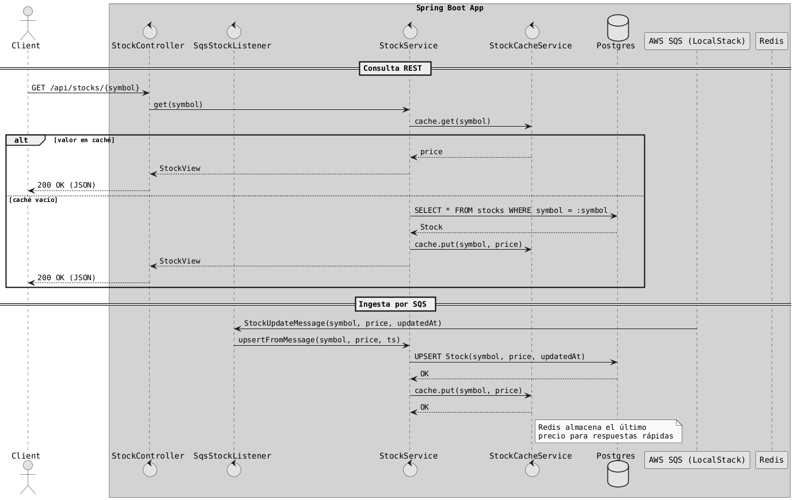

# Java Avanzado + Testcontainers: Stocks App

Aplicación de ejemplo con Spring Boot para demostrar el uso de Testcontainers y servicios externos con Docker.

**Escenario:** la app recibe actualizaciones de acciones (stocks) desde una cola SQS, persiste los datos en Postgres y mantiene el precio en un caché Redis. Expone un API REST para consultar los valores.

---

## 🎓 Laboratorio: Pruebas de Integración con Testcontainers

Este repositorio es un ejercicio práctico para aprender **Testcontainers** y su integración con **Spring Boot**.

### Objetivos de aprendizaje

- Configurar contenedores Docker para pruebas de integración
- Usar `@DynamicPropertySource` para inyectar propiedades
- Trabajar con diferentes tipos de contenedores:
  - `PostgreSQLContainer` (contenedor especializado)
  - `GenericContainer` (contenedor genérico)
  - `LocalStackContainer` (simulación de AWS)
- Probar flujos asíncronos con Awaitility

### Ejercicios

| # | Ejercicio | Archivo de test | Documentación |
|---|-----------|----------------|---------------|
| 1 | **PostgreSQL** - Pruebas de persistencia JPA | [StockRepositoryIT.java](src/test/java/com/example/stocks/containers/StockRepositoryIT.java) | [📖 Guía](docs/ejercicio-postgres.md) |
| 2 | **Redis** - Pruebas de caché | [RedisCacheIT.java](src/test/java/com/example/stocks/containers/RedisCacheIT.java) | [📖 Guía](docs/ejercicio-redis.md) |
| 3 | **LocalStack (SQS)** - Pruebas de mensajería | [SqsListenerIT.java](src/test/java/com/example/stocks/containers/SqsListenerIT.java) | [📖 Guía](docs/ejercicio-sqs.md) |

### Cómo trabajar con los ejercicios

1. **Lee la documentación** del ejercicio correspondiente en la carpeta `docs/`
2. **Abre el archivo de test** indicado
3. **Completa los TODO** siguiendo las instrucciones
4. **Ejecuta el test** para verificar tu solución:

   ```bash
   mvn -Dtest=NombreDelTest verify
   ```

### Verificar tu progreso

Ejecuta todos los tests de integración para verificar que has completado todos los ejercicios:

```bash
mvn verify
```

> **Nota**: Los tests de integración usan el sufijo `IT` y son ejecutados por el plugin `maven-failsafe-plugin` en la fase `verify`.

---

## Diagrama de la lógica de la aplicación (PlantUML)

El siguiente diagrama resume el flujo principal de la aplicación (API REST + procesamiento de mensajes SQS + persistencia y caché):



---

## Tecnologías

- Spring Boot 3.4.x (Web, Data JPA, Data Redis, Validation)
- Postgres 16
- Redis 7
- AWS SQS (LocalStack para entorno local)
- Testcontainers 1.20.x (Postgres, LocalStack y Redis vía GenericContainer)

---

## Estructura del proyecto

```
src/main/java/com/example/stocks/
├── domain/Stock.java              # Entidad JPA
├── repository/StockRepository.java # Repositorio Spring Data JPA
├── service/
│   ├── StockService.java          # Lógica de negocio
│   └── StockCacheService.java     # Caché con Redis
├── messaging/
│   ├── StockUpdateMessage.java    # DTO del mensaje SQS
│   ├── SqsStockListener.java      # Listener SQS
│   └── SqsStockSeeder.java        # Generador de mensajes de prueba
├── api/StockController.java       # Endpoints REST
└── config/AwsSqsConfig.java       # Configuración AWS

src/test/java/com/example/stocks/
├── containers/                    # 🎯 EJERCICIOS AQUÍ
│   ├── StockRepositoryIT.java     # Ejercicio 1: PostgreSQL
│   ├── RedisCacheIT.java          # Ejercicio 2: Redis
│   └── SqsListenerIT.java         # Ejercicio 3: LocalStack SQS
└── ...

docs/
├── ejercicio-postgres.md          # Guía ejercicio 1
├── ejercicio-redis.md             # Guía ejercicio 2
└── ejercicio-sqs.md               # Guía ejercicio 3
```

---

## Cómo ejecutar (local con Docker Compose)

### Requisitos previos

- Docker y Docker Compose instalados
- Java 21 y Maven 3.9+

### 1) Levantar servicios externos

```bash
docker compose up -d
```

Esto levanta:

- Postgres en `localhost:5432` (postgres/postgres)
- Redis en `localhost:6379`
- LocalStack en `localhost:4566` con SQS y la cola `stock-updates`

### 2) Ejecutar la aplicación

**Opción A - Desde Maven (desarrollo):**

```bash
mvn spring-boot:run -Dspring-boot.run.jvmArguments="\
  -DDB_HOST=localhost -DDB_PORT=5432 -DDB_NAME=stocks \
  -DDB_USER=postgres -DDB_PASSWORD=postgres \
  -DREDIS_HOST=localhost -DREDIS_PORT=6379 \
  -DAWS_REGION=us-east-1 -DAWS_SQS_ENDPOINT=http://localhost:4566 \
  -DSQS_QUEUE_NAME=stock-updates"
```

**Opción B - Con Docker Compose:**

```bash
mvn -DskipTests spring-boot:build-image
docker compose up -d app
```

### 3) Probar el API REST

```bash
# Listar todas las acciones
curl http://localhost:8080/api/stocks

# Consultar por símbolo
curl http://localhost:8080/api/stocks/AAPL
```

### 4) Enviar un mensaje a SQS

```bash
awslocal sqs send-message \
  --queue-url $(awslocal sqs get-queue-url --queue-name stock-updates --query QueueUrl --output text) \
  --message-body '{"symbol":"AAPL","price":195.12,"updatedAt":"2025-01-01T12:00:00Z"}'
```

---

## Configuración (application.yml)

| Servicio | Variables de entorno |
|----------|---------------------|
| PostgreSQL | `DB_HOST`, `DB_PORT`, `DB_NAME`, `DB_USER`, `DB_PASSWORD` |
| Redis | `REDIS_HOST`, `REDIS_PORT` |
| SQS | `AWS_REGION`, `AWS_SQS_ENDPOINT`, `SQS_QUEUE_NAME` |

---

## Ejercicios adicionales propuestos

1. ✨ Añadir un endpoint para crear/actualizar manualmente una acción
2. ✅ Añadir validación al DTO `StockUpdateMessage` (precio > 0)
3. 📬 Implementar una DLQ (cola de mensajes muertos) en SQS
4. ⏰ Cambiar la caducidad del caché y observar el impacto

---

## Resolución de problemas

| Problema | Solución |
|----------|----------|
| La app no arranca | Verificar que Postgres/Redis/LocalStack estén corriendo |
| Mensaje SQS no se deserializa | Verificar JSON válido con campos `symbol`, `price`, `updatedAt` (ISO-8601) |
| Tests fallan con "port already bound" | Detener contenedores previos: `docker compose down` |
| "Mapped port can only be obtained..." | Usar bloque `static {}` para iniciar contenedores |

---

## Notas sobre versiones

- Spring Boot 3.4.x
- Spring Cloud AWS SQS 3.1.x
- Testcontainers 1.20.x
- JDK 21
