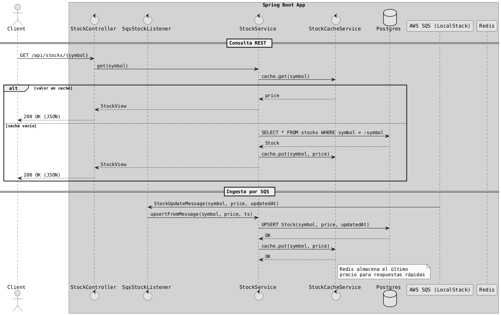

# Java Avanzado + Testcontainers: Stocks App

Aplicación de ejemplo con Spring Boot para demostrar el uso de Testcontainers y servicios externos con Docker.

**Escenario:** la app recibe actualizaciones de acciones (stocks) desde una cola SQS, persiste los datos en Postgres y mantiene el precio en un caché Redis. Expone un API REST para consultar los valores.

## Diagrama de la lógica de la aplicación (PlantUML)
El siguiente diagrama resume el flujo principal de la aplicación (API REST + procesamiento de mensajes SQS + persistencia y caché):



## Tecnologías
- Spring Boot 3.4.x (Web, Data JPA, Data Redis, Validation)
- Postgres 16
- Redis 7
- AWS SQS (LocalStack para entorno local)
- Testcontainers 1.20.x (Postgres, LocalStack y Redis vía GenericContainer)

## Estructura del proyecto (resumen)
- src/main/java/com/example/stocks:
  - domain/Stock: entidad JPA.
  - repository/StockRepository: repositorio Spring Data JPA.
  - service/StockService: lógica de negocio, actualización desde mensajes + uso de cache Redis.
  - service/StockCacheService: caché de precios con StringRedisTemplate.
  - messaging/StockUpdateMessage: DTO que representa el mensaje SQS.
  - messaging/SqsStockListener: listener con @SqsListener que procesa los mensajes y actualiza DB/Redis.
  - api/StockController: endpoints REST para listar y consultar acciones.
  - config/AwsSqsConfig: configuración base para listeners SQS.
- src/main/resources/application.yml: configuración de DB, Redis y SQS (mediante variables de entorno).
- docker-compose.yml: Postgres, Redis y LocalStack.
- docker/localstack/10-create-sqs.sh: crea la cola SQS en el arranque de LocalStack.
- src/test/java/com/example/stocks/containers/*: esqueletos de pruebas con Testcontainers.

## Cómo ejecutar (local con Docker Compose)
1) Requisitos previos:
- Docker y Docker Compose instalados.
- Java 21 y Maven 3.9+.

2) Levantar servicios externos:
docker compose up -d
Esto levanta:
- Postgres en localhost:5432 (postgres/postgres)
- Redis en localhost:6379
- LocalStack en localhost:4566 con SQS y la cola stock-updates

3A) Ejecutar la aplicación desde Maven (local, sin contenedor) — ejemplo con variables como argumentos JVM:
`mvn spring-boot:run -Dspring-boot.run.jvmArguments="-DDB_HOST=localhost -DDB_PORT=5432 -DDB_NAME=stocks -DDB_USER=postgres -DDB_PASSWORD=postgres -DREDIS_HOST=localhost -DREDIS_PORT=6379 -DAWS_REGION=us-east-1 -DAWS_SQS_ENDPOINT=http://localhost:4566 -DSQS_QUEUE_NAME=stock-updates"`

3B) Ejecutar la aplicación en contenedor junto a los servicios (Docker Compose):
- Opción A (Buildpacks, recomendado con Spring Boot 3.4.x):
  1. Construir imagen OCI con Paketo Buildpacks:
     `mvn -DskipTests spring-boot:build-image`
     Esto generará la imagen `java-avanzado-testcontainers:0.0.1-SNAPSHOT` usada por docker-compose.
  2. Levantar todo (incluida la app):
     `docker compose up -d app`
- Opción B (Dockerfile incluido):
  1. Construir la imagen con Dockerfile multi-stage:
     `docker compose build app`
  2. Levantar la app (si los servicios ya están arriba, sólo la app):
     `docker compose up -d app`

Notas:
- La app expone el puerto 8080 (mapeado a localhost:8080 en docker-compose).
- Las variables de entorno (DB_*, REDIS_*, AWS_*, SQS_QUEUE_NAME) se inyectan desde docker-compose y apuntan a los otros servicios del mismo Compose.

4) Probar el API REST:
- Listar acciones: curl http://localhost:8080/api/stocks
- Consultar por símbolo (por ejemplo AAPL): curl http://localhost:8080/api/stocks/AAPL

5) Enviar un mensaje a SQS (LocalStack):
```shell
awslocal sqs send-message --queue-url $(awslocal sqs get-queue-url --queue-name stock-updates --query QueueUrl --output text) --message-body '{"symbol":"AAPL","price":195.12,"updatedAt":"2025-01-01T12:00:00Z"}'
```

### Configuración (application.yml)
Propiedades clave parametrizadas por variables de entorno:
- Postgres: DB_HOST, DB_PORT, DB_NAME, DB_USER, DB_PASSWORD
- Redis: REDIS_HOST, REDIS_PORT
- SQS: AWS_REGION, AWS_SQS_ENDPOINT, SQS_QUEUE_NAME
Valores por defecto apuntan a localhost y cola stock-updates.

### Pruebas con Testcontainers (GUÍA para estudiantes)
Los tests incluidos son esqueletos con instrucciones en comentarios para completarlos. Practicar:
1) Testcontainers + Postgres (StockRepositoryIT)
- Usar PostgreSQLContainer con @Container y @Testcontainers.
- Exponer propiedades con @DynamicPropertySource: spring.datasource.url, username, password.
- Inyectar StockRepository y probar guardar/consultar.

2) Testcontainers + Redis (RedisCacheIT)
- Usar GenericContainer("redis:7-alpine") con withExposedPorts(6379).
- Propagar spring.data.redis.host y spring.data.redis.port con @DynamicPropertySource.
- Inyectar StockCacheService y validar put/get.

3) Testcontainers + LocalStack (SQS) (SqsListenerIT)
- Usar LocalStackContainer con el servicio SQS.
- Propagar cloud.aws.region.static, cloud.aws.sqs.endpoint, credenciales.
- Crear la cola con AWS SDK v2 (SqsClient) o utilidades de Spring Cloud AWS.
- Enviar un mensaje JSON con la forma de StockUpdateMessage.
- Esperar con Awaitility a que el listener procese y verificar en DB/Redis.

### Ejercicios propuestos
1) Añadir un endpoint para crear/actualizar manualmente una acción y almacenarla en Redis.
2) Añadir validación al DTO StockUpdateMessage (precio > 0) y probar el comportamiento en el listener.
3) Implementar una DLQ (cola de mensajes muertos) en SQS para errores.
4) Cambiar la caducidad del caché y observar el impacto en el endpoint.

### Notas sobre versiones
- Spring Boot 3.4.x en pom.xml.
- Spring Cloud AWS SQS 3.1.x compatible con Spring Boot 3.x.
- Testcontainers 1.20.x.

### Resolución de problemas
- La app no arranca: verifica Postgres/Redis/LocalStack.
- Mensaje SQS no se deserializa: JSON válido con fields symbol, price, updatedAt (ISO-8601).
- Problemas de puertos: ajusta [docker-compose.yml](docker-compose.yml) o variables de entorno.
