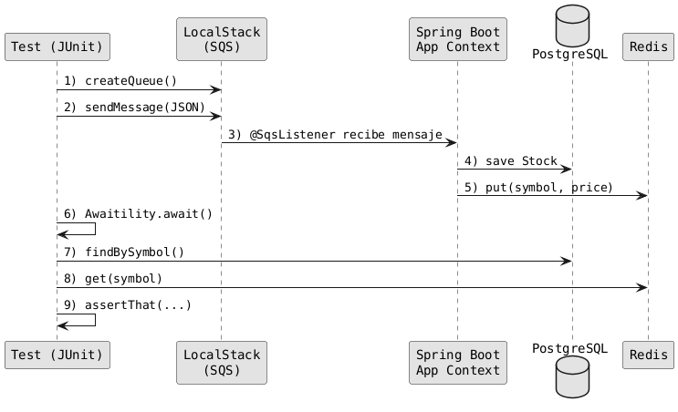

# Ejercicio 3: Prueba de Integración con LocalStack (SQS)

## Objetivo

Aprender a usar **Testcontainers** con **LocalStack** para simular servicios de AWS (SQS) durante las pruebas de integración, y verificar el procesamiento asíncrono de mensajes.

## Archivo a completar

`src/test/java/com/example/stocks/containers/SqsListenerIT.java`

---

## Paso 1: Añadir las anotaciones de clase

```java
@SpringBootTest
@Testcontainers
public class SqsListenerIT extends BaseContainersTest {
```

Esta prueba necesita `@SpringBootTest` porque:

- El listener SQS es un componente de Spring
- Necesitamos que la aplicación procese mensajes realmente
- Verificamos efectos en DB y Redis

---

## Paso 2: Declarar los contenedores

Necesitamos los tres contenedores: **LocalStack**, **PostgreSQL** y **Redis**:

```java
@SuppressWarnings("resource")
static LocalStackContainer localstack = new LocalStackContainer(
        DockerImageName.parse("localstack/localstack:3"))
        .withServices(LocalStackContainer.Service.SQS);

@SuppressWarnings("resource")
static PostgreSQLContainer<?> postgres = new PostgreSQLContainer<>("postgres:16-alpine");

@SuppressWarnings("resource")
static GenericContainer<?> redis = new GenericContainer<>(
        DockerImageName.parse("redis:7-alpine"))
        .withExposedPorts(6379);
```

Iniciar todos en bloque estático:

```java
static {
    localstack.start();
    postgres.start();
    redis.start();
}
```

---

## Paso 3: Configurar las propiedades dinámicas

```java
@DynamicPropertySource
static void awsProps(DynamicPropertyRegistry registry) {
    // AWS / LocalStack
    registry.add("spring.cloud.aws.region.static", localstack::getRegion);
    registry.add("spring.cloud.aws.sqs.endpoint", 
        () -> localstack.getEndpointOverride(SQS).toString());
    registry.add("spring.cloud.aws.credentials.access-key", localstack::getAccessKey);
    registry.add("spring.cloud.aws.credentials.secret-key", localstack::getSecretKey);

    // Postgres
    registry.add("spring.datasource.url", postgres::getJdbcUrl);
    registry.add("spring.datasource.username", postgres::getUsername);
    registry.add("spring.datasource.password", postgres::getPassword);

    // Redis
    registry.add("spring.data.redis.host", redis::getHost);
    registry.add("spring.data.redis.port", () -> redis.getMappedPort(6379));
}
```

> **Nota**: Las propiedades de AWS deben usar el prefijo `spring.cloud.aws` que es el que espera Spring Cloud AWS.

---

## Paso 4: Inyectar dependencias

```java
@Autowired
private StockRepository stockRepository;

@Autowired
private StockCacheService stockCacheService;

@Value("${app.sqs.queue-name}")
private String queueName;
```

---

## Paso 5: Implementar el test

El test debe:

1. Crear la cola SQS en LocalStack
2. Enviar un mensaje
3. Esperar a que el listener lo procese
4. Verificar los efectos

### Paso 5.1: Crear un cliente SQS

```java
try (SqsClient sqsClient = SqsClient.builder()
        .endpointOverride(localstack.getEndpointOverride(SQS))
        .region(Region.of(localstack.getRegion()))
        .credentialsProvider(StaticCredentialsProvider.create(
                AwsBasicCredentials.create(
                        localstack.getAccessKey(), 
                        localstack.getSecretKey())))
        .build()) {
    // ... resto del test
}
```

### Paso 5.2: Crear la cola

```java
sqsClient.createQueue(r -> r.queueName(queueName));
String queueUrl = sqsClient.getQueueUrl(r -> r.queueName(queueName)).queueUrl();
```

### Paso 5.3: Enviar un mensaje JSON

```java
String symbol = "AAPL";
BigDecimal price = new BigDecimal("195.12");
String jsonBody = """
        {
          "symbol": "%s",
          "price": %s,
          "updatedAt": "%s"
        }
        """.formatted(symbol, price, Instant.now());

sqsClient.sendMessage(r -> r.queueUrl(queueUrl).messageBody(jsonBody));
```

### Paso 5.4: Esperar con Awaitility

```java
Awaitility.await()
        .atMost(Duration.ofSeconds(10))
        .untilAsserted(() -> {
            // Verificar DB
            Optional<Stock> stock = stockRepository.findBySymbol(symbol);
            assertThat(stock).isPresent();
            assertThat(stock.get().getPrice()).isEqualByComparingTo(price);

            // Verificar Redis
            Optional<BigDecimal> cachedPrice = stockCacheService.get(symbol);
            assertThat(cachedPrice).isPresent();
            assertThat(cachedPrice.get()).isEqualByComparingTo(price);
        });
```

> **¿Por qué Awaitility?** El procesamiento de mensajes SQS es **asíncrono**. No podemos verificar inmediatamente después de enviar el mensaje porque el listener puede no haberlo procesado todavía.

---

## Verificación

Ejecuta el test con:

```bash
mvn -Dtest=SqsListenerIT verify
```

---

## Conceptos clave aprendidos

| Concepto | Descripción |
|----------|-------------|
| `LocalStackContainer` | Simula servicios de AWS localmente |
| `.withServices(SQS)` | Especifica qué servicios de AWS activar |
| `getEndpointOverride()` | Obtiene la URL del servicio simulado |
| `Awaitility` | Librería para esperar condiciones asíncronas |
| `untilAsserted()` | Repite las aserciones hasta que pasen o timeout |

---

## Diagrama del flujo del test



---

## Imports necesarios

```java
import org.awaitility.Awaitility;
import org.junit.jupiter.api.Test;
import org.springframework.beans.factory.annotation.Autowired;
import org.springframework.beans.factory.annotation.Value;
import org.springframework.boot.test.context.SpringBootTest;
import org.springframework.test.context.DynamicPropertyRegistry;
import org.springframework.test.context.DynamicPropertySource;
import org.testcontainers.containers.GenericContainer;
import org.testcontainers.containers.PostgreSQLContainer;
import org.testcontainers.containers.localstack.LocalStackContainer;
import org.testcontainers.junit.jupiter.Testcontainers;
import org.testcontainers.utility.DockerImageName;
import software.amazon.awssdk.auth.credentials.AwsBasicCredentials;
import software.amazon.awssdk.auth.credentials.StaticCredentialsProvider;
import software.amazon.awssdk.regions.Region;
import software.amazon.awssdk.services.sqs.SqsClient;

import java.math.BigDecimal;
import java.time.Duration;
import java.time.Instant;
import java.util.Optional;

import static org.assertj.core.api.Assertions.assertThat;
import static org.testcontainers.containers.localstack.LocalStackContainer.Service.SQS;
```

---

## Dependencia adicional requerida

Si no está presente, añade Awaitility al `pom.xml`:

```xml
<dependency>
    <groupId>org.awaitility</groupId>
    <artifactId>awaitility</artifactId>
    <scope>test</scope>
</dependency>
```
